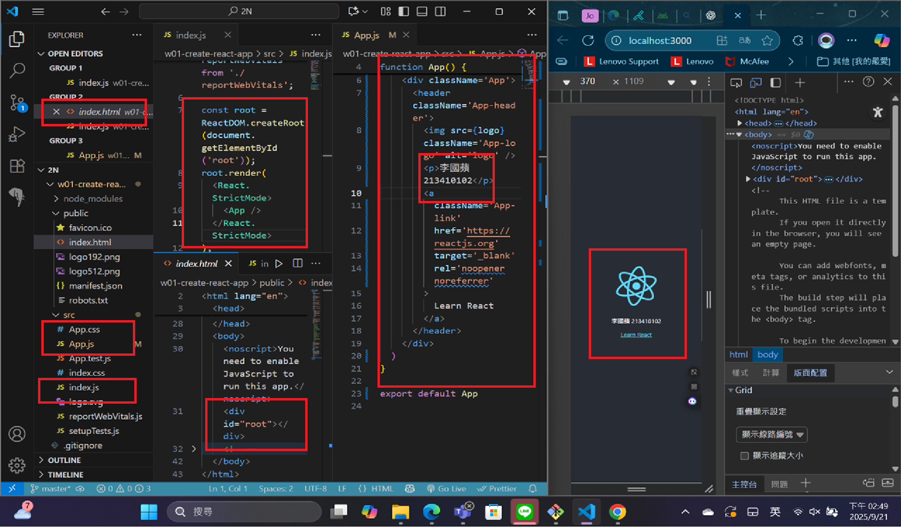
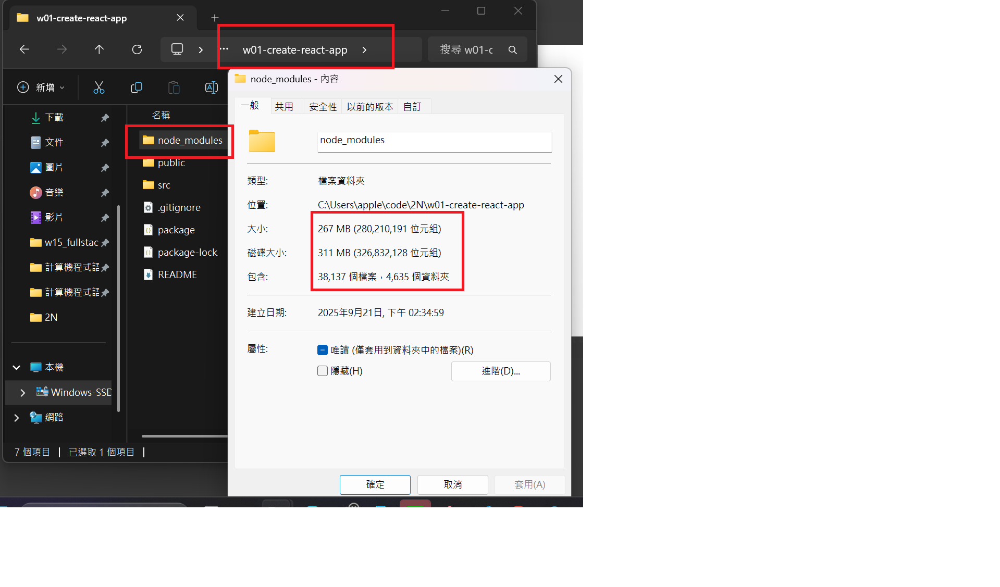
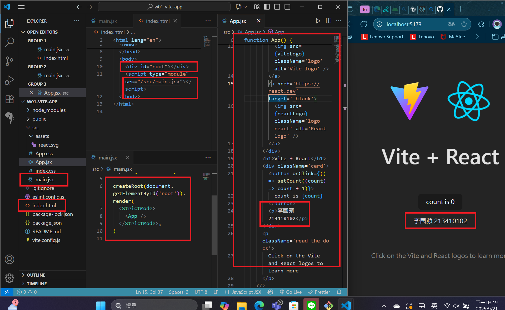
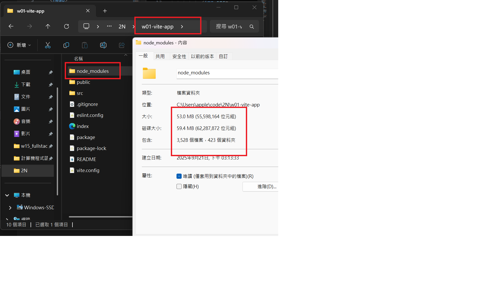

[Github URL](https://github.com/apple550678/1141-2N-demo-apple-02)

### W01-P1: Use create-react-app to create a new React app

#### => show how the index.html page being rendered



#### => share the size of node module



```
d8b98df apple550678     Sun Sep 21 15:07:55 2025 +0800  W01-P1: Use create-react-app to create a new React app
```

### W01-P2: Use vite to create a new React app

#### => show how the index.html page being rendered



#### => share the size of node module



```
b5b3ce0 apple550678     Sun Sep 21 15:28:06 2025 +0800  W01-P2: Use vite to create a new React app
```

### W01-logs: git logs of W01 and share to htchung@gms.tku.edu.tw (teacher) and sian-0018 (TA)


