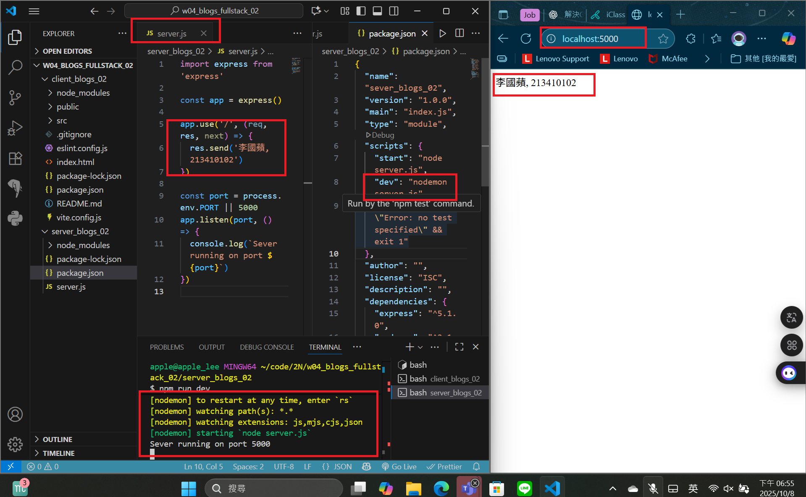
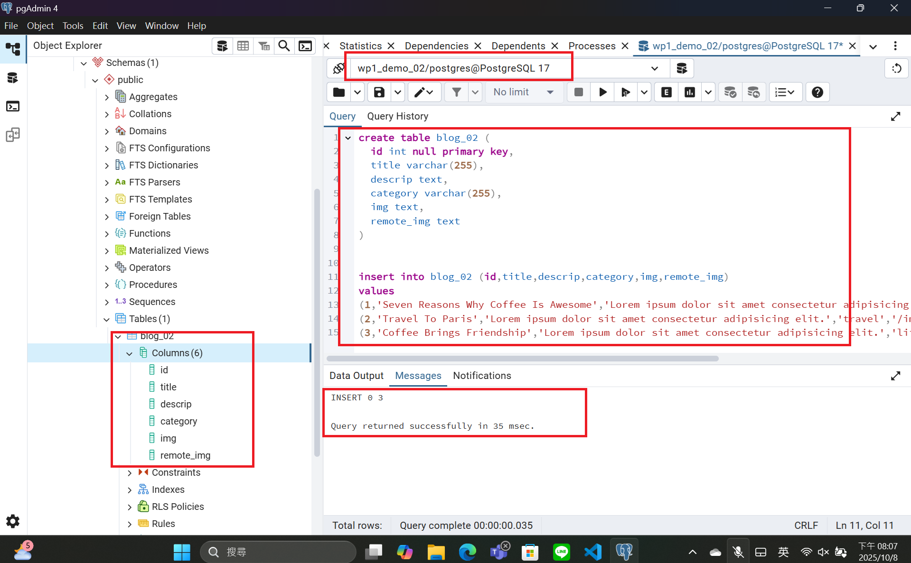
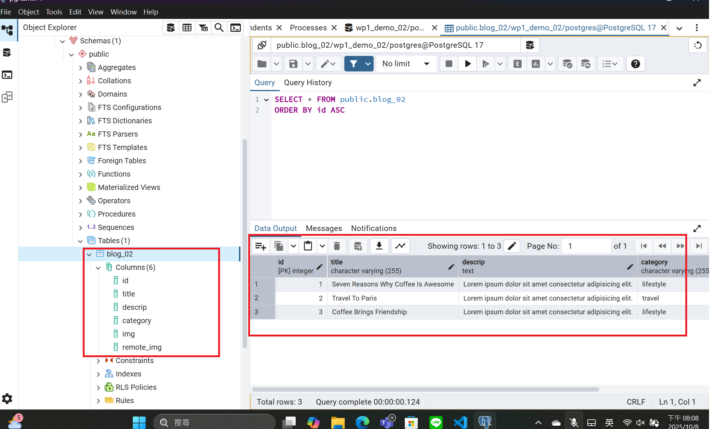
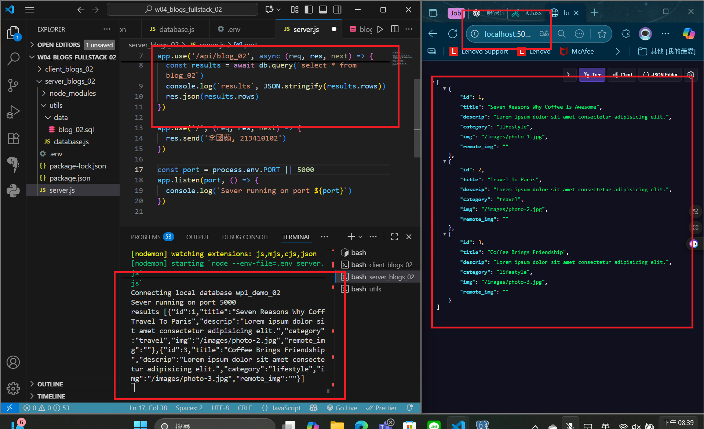
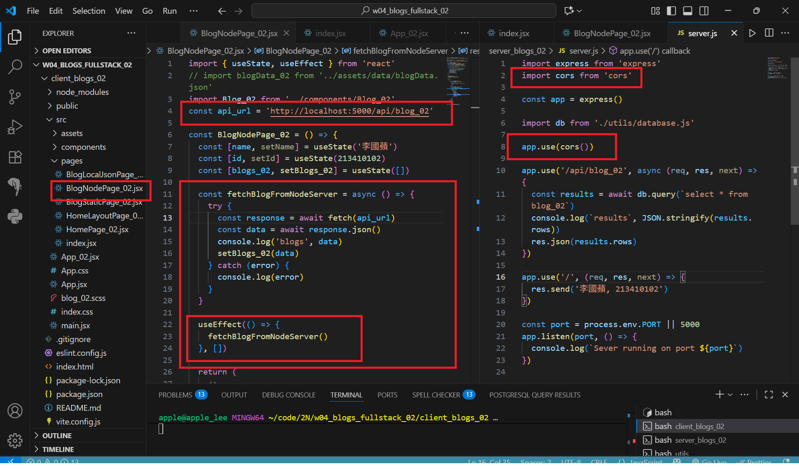
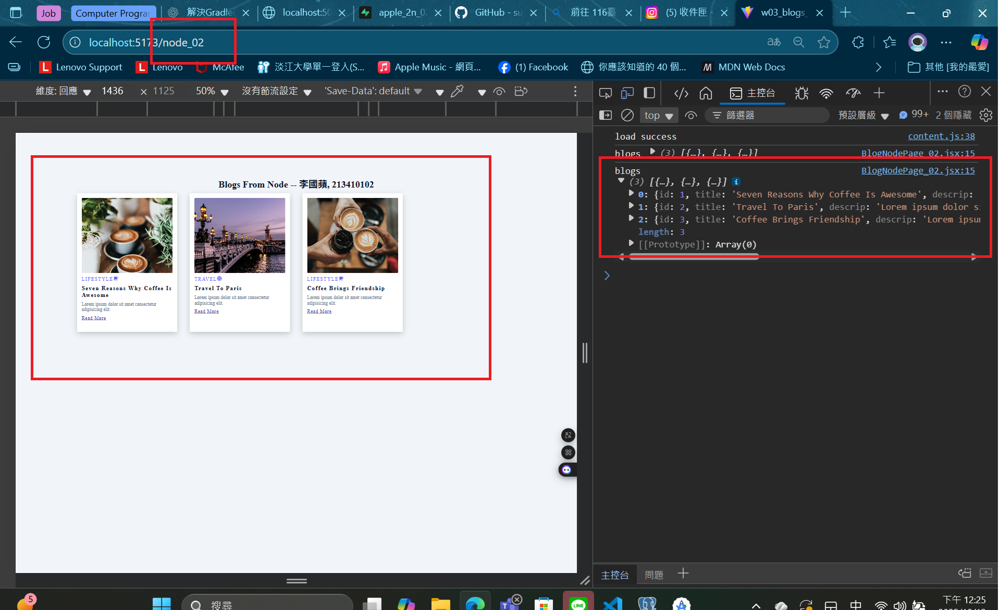

[Github URL](https://github.com/apple550678/1141-2N-demo-apple-02)

###　 Video: W04-P1: Create a express Web server to show your info



```
f6a81c2 apple550678     Wed Oct 8 18:59:40 2025 +0800   Video: W04-P1: Create a express Web server to show your info--after=2025-10-08
```

### Video: W04-P2: Create blog_xx table with 3 data, implement route /api/blog_xx to return a json array with 3 data

#### => SQL to create blog_xx table and 3 data



#### => show 3 data



#### => implement route /api/blog_xx



```
a163cba apple550678     Wed Oct 8 20:41:33 2025 +0800   Video: W04-P2: Create blog_xx table with 3 data, implement route /api/blog_xx to return a json array with 3 data--after=2025-10-08
```

###　 Video: W04-P3: from client side to get json data from Node

#### => modified client and server code



#### => Chrome, show 3 blogs



```
c1c996a apple550678     Sun Oct 12 12:29:51 2025 +0800  Video: W04-P3: from client side to get json data from Node--after=2025-10-12
```
