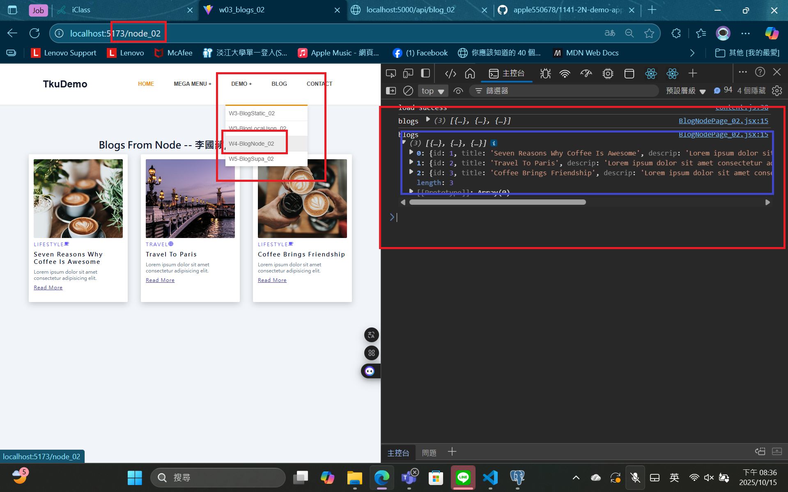
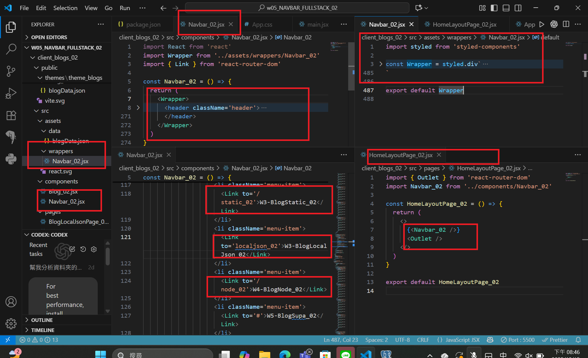
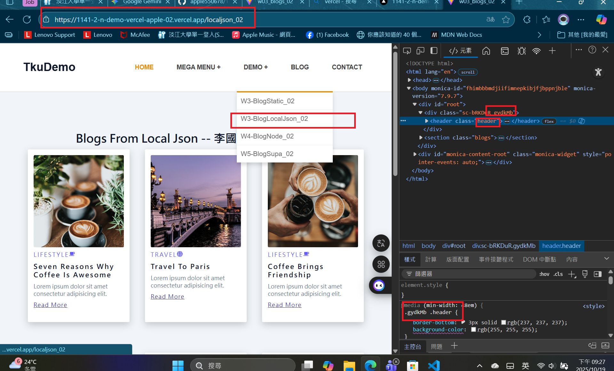

[Github URL](https://github.com/apple550678/1141-2N-demo-apple-02)
[Github URL for Vercel](https://github.com/apple550678/1141_2N_demo_vercel_apple-02)
[Vercel URL](https://1141-2-n-demo-vercel-apple-02.vercel.app/localjson_02)

### Video: W05-P1: Create Navbar_xx using styled components, and show BlogNodePage_xx

##### => Chrome



##### => relevant code



```
a3f1040 apple550678     Wed Oct 15 20:52:16 2025 +0800  Video: W05-P1: Create Navbar_xx using styled components, and show BlogNodePage_xx--after=2025-10-14
```

### Video: W05-P2: Deploy the code to Vercel

#### => Show BlogLocalJson in Vercel



#### => Github repo with Vercel link


#### => Github demo_vecel repo and Vercel URL

```
99b06fa apple550678     Sun Oct 19 21:34:48 2025 +0800  Video: W05-P2: Deploy the code to Vercel--after=2025-10-19
```

###　 Video: W05-P3: Use tailwind css to show HomePage_xx in Vercel


```
0de85a9 apple550678     Sun Oct 19 22:03:53 2025 +0800  Video: W05-P3: Use tailwind css to show HomePage_xx in Vercel--after=2025-10-19
```

### Video: W05-P4: Show BookListPage_xx using styled components


```

```
