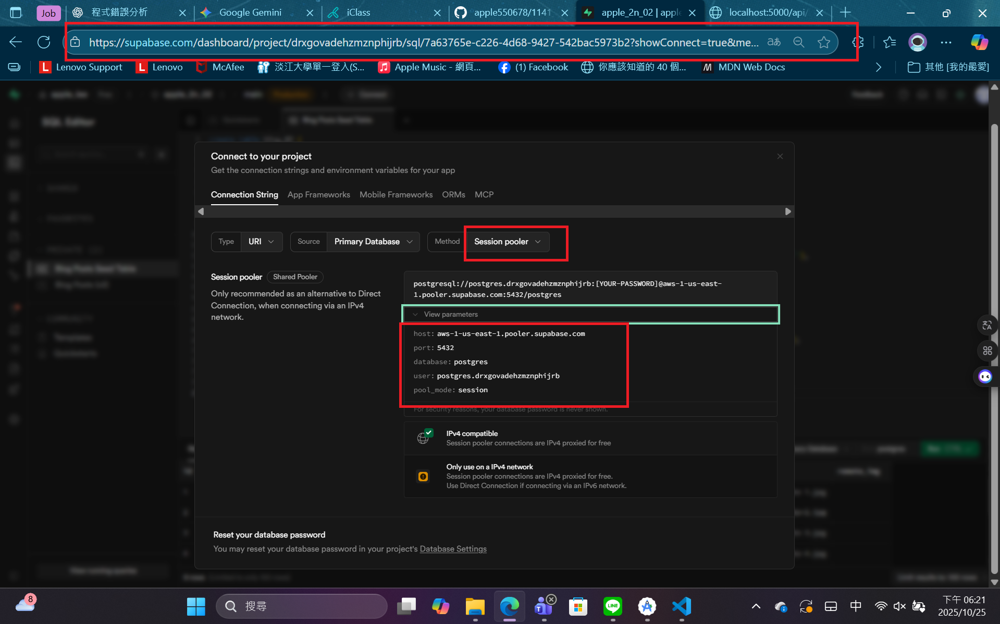
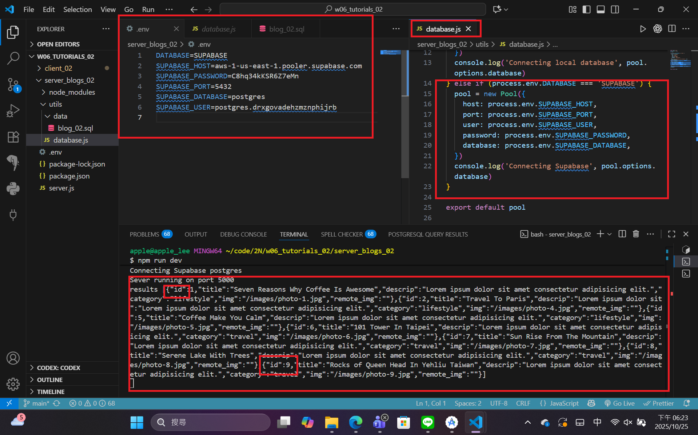
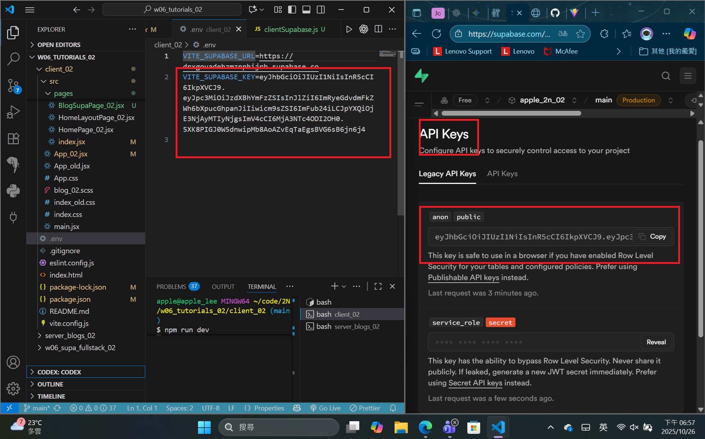
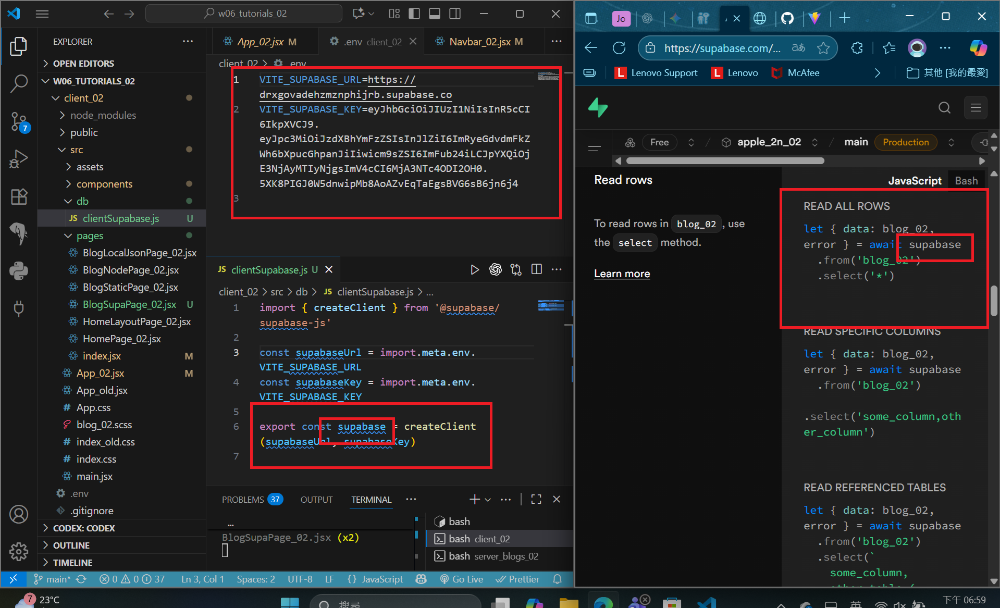
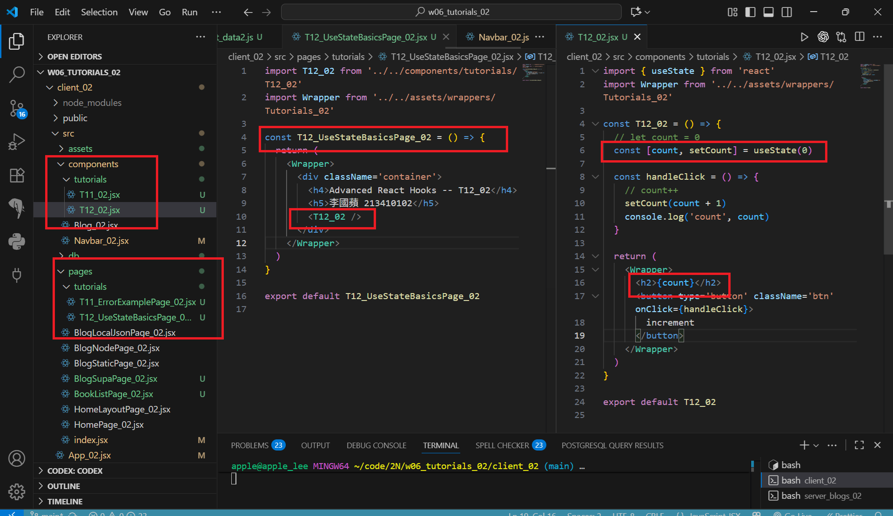
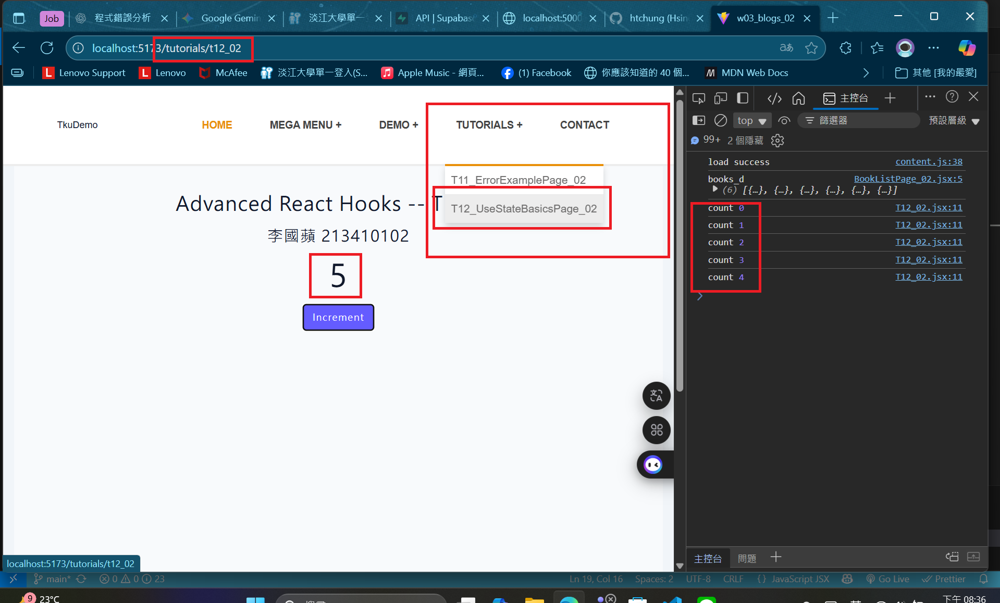

[Github URL](https://github.com/apple550678/1141-2N-demo-apple-02)
[Github URL for Vercel](https://github.com/apple550678/1141_2N_demo_vercel_apple-02)
[Vercel URL](https://1141-2-n-demo-vercel-apple-02.vercel.app/localjson_02)

### Video: for W06-P1 & W06-P2

### W06-P1: share URL of Github demo Vercel


```
367462c apple550678     Sat Oct 25 19:10:49 2025 +0800  W06-P1: share URL of Github demo Vercel--after=2025-10-24
```

### W06-P2: Supabase settings in Node.js, can connect to Supabase to get 9 blogs data

#### => able to get 9 blogs data in Supabase


#### => connect parameters in Supabase



#### => server code in Supabase setting



```
1b1daad apple550678     Sat Oct 25 19:11:59 2025 +0800  W06-P2: Supabase settings in Node.js, can connect to Supabase to get 9 blogs data--after=2025-10-24
```

### W06-P3: Use Supabase client to get 9 blogs data

#### => show API keys in Supabase



#### => Supabase client code



#### => Use BlogSupaPage_xx.jsx to get blogs data from Supabase


```
6069832 apple550678     Sun Oct 26 19:05:41 2025 +0800  W06-P3: Use Supabase client to get 9 blogs data--after=2025-10-26
```

### Video: W06-P4: Implement Tutorial T11_xx and T12_xx

#### => show code for T12_xx



#### => Chrome result



```

```
