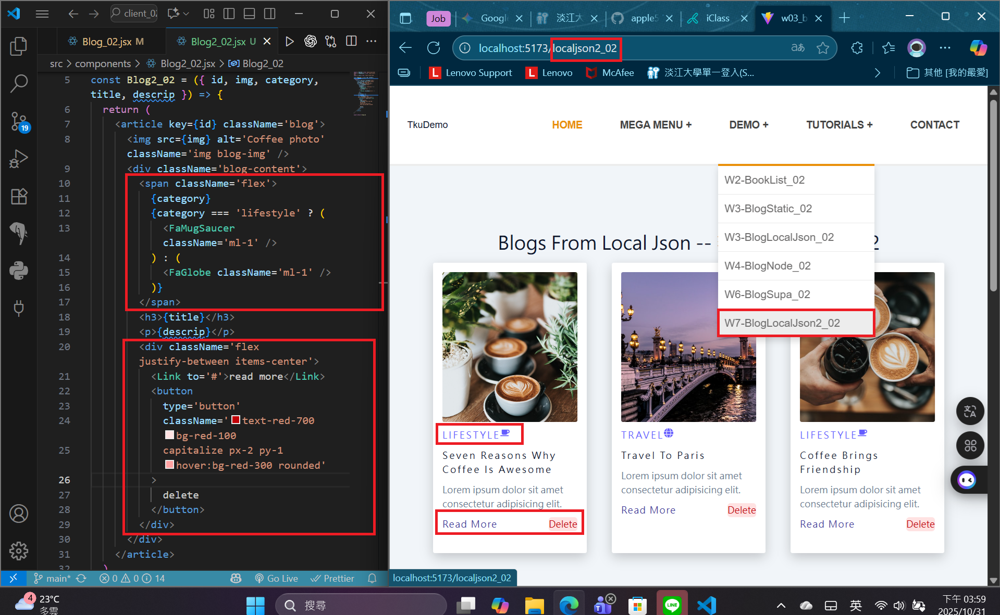
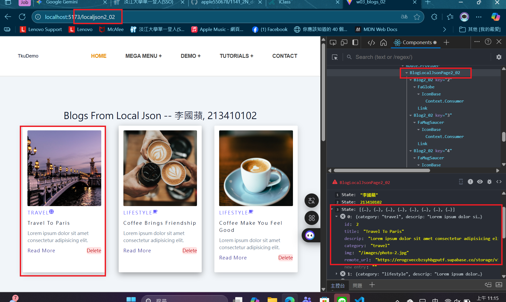
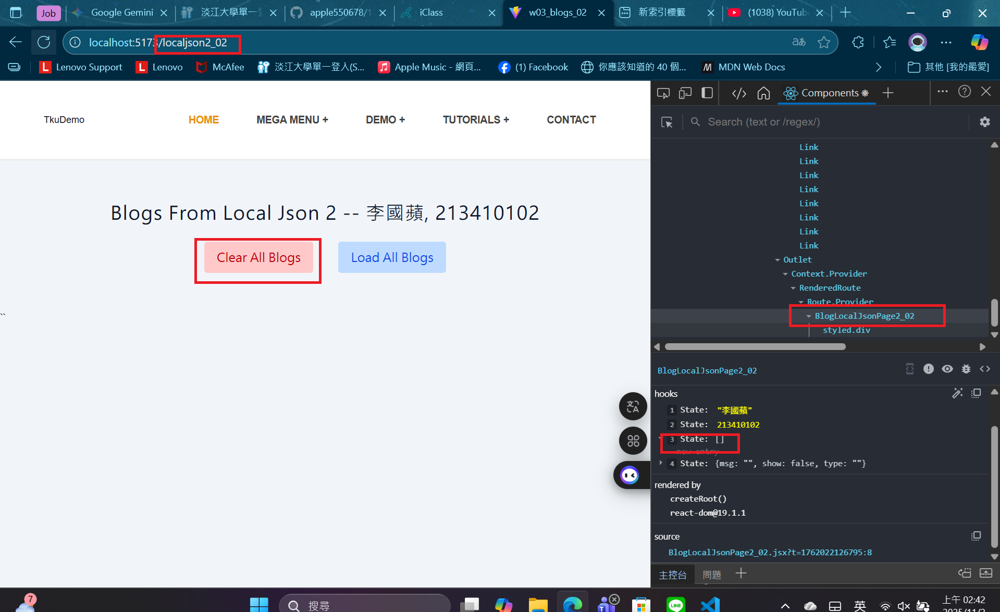
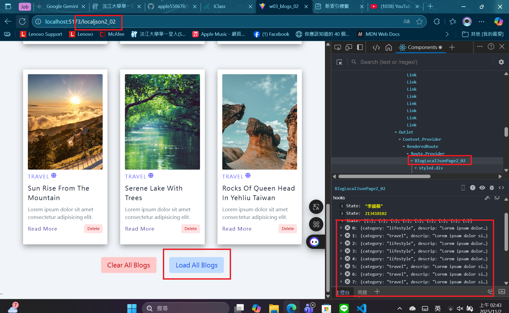
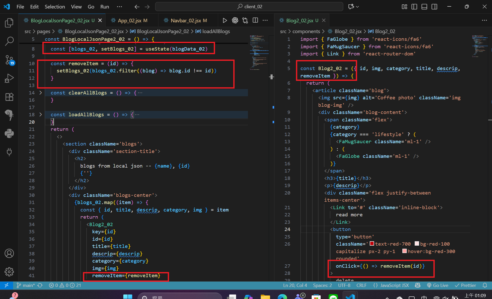
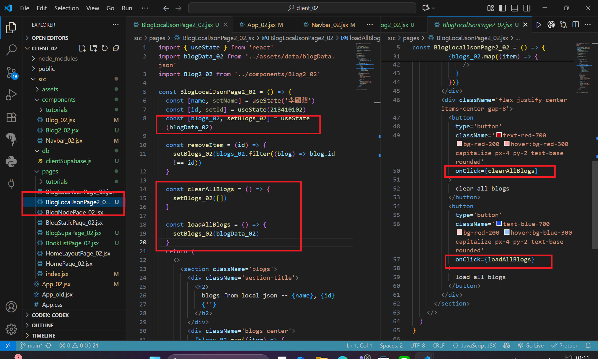
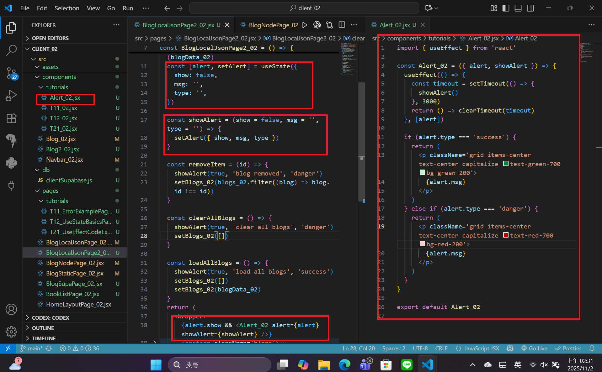

[Github URL](https://github.com/apple550678/1141-2N-demo-apple-02)
[Github URL for Vercel](https://github.com/apple550678/1141_2N_demo_vercel_apple-02)
[Vercel URL](https://1141-2-n-demo-vercel-apple-02.vercel.app/localjson_02)

### Video: W07-P1: Use tailwind to style react icons and add a delete button



```
ab2e534 apple550678     2025-10-31 16:06:47 +0800       Video: W07-P1: Use tailwind to style react icons and add a delete button
```

### Video: W07-P2: Implement delete a blog, clear all blogs, load all blogs

#### => delete first blog



#### => clear all blogs



#### => load all blogs



#### => code for deleting a blog



#### => code for clear and load all blogs



```
ca3c8d2 apple550678     2025-11-02 01:13:55 +0800       Video: W07-P2: Implement delete a blog, clear all blogs, load all blogs
```

### Video: W07-P3: Implement Alert_xx

#### => code for Alert_xx



```

```
