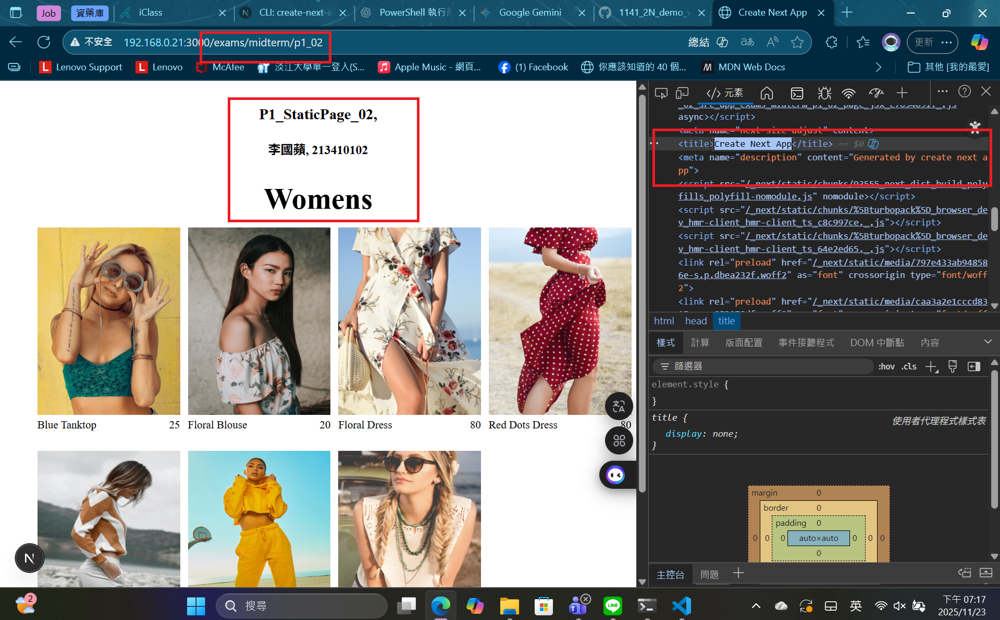
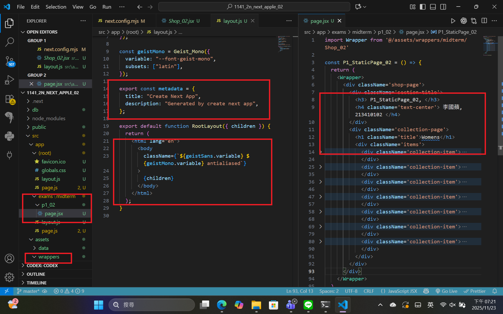
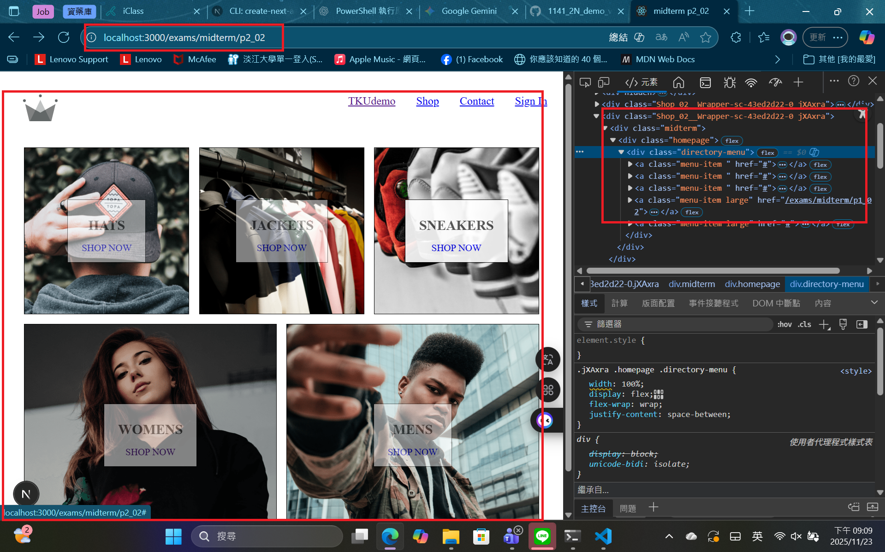
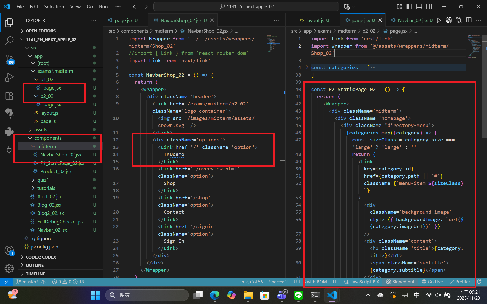
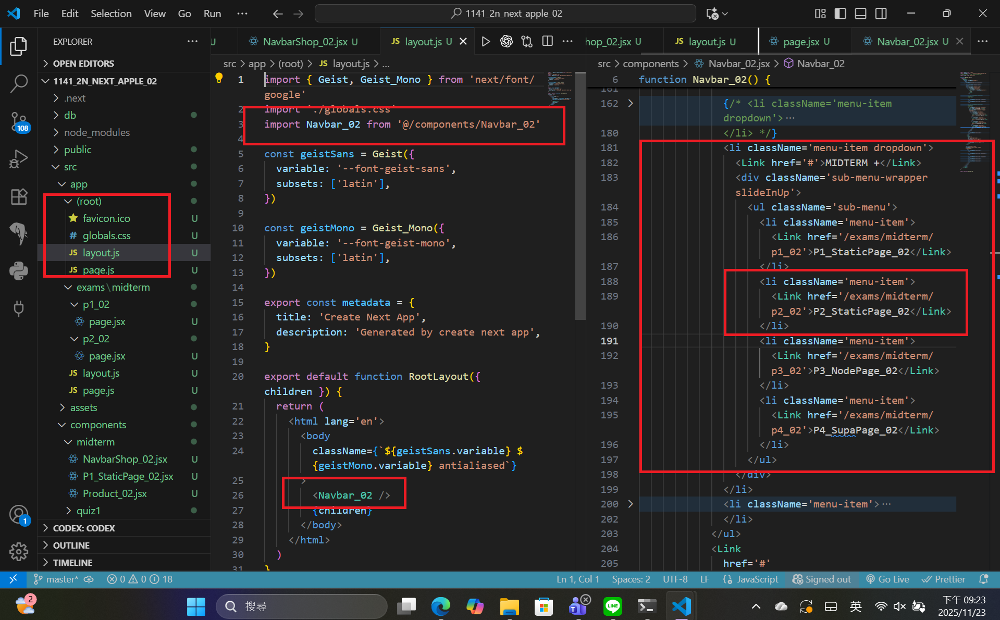

[Github URL](https://github.com/apple550678/1141-2N-demo-apple-02)
[Github URL for Vercel](https://github.com/apple550678/1141_2N_demo_vercel_apple-02)
[Vercel URL](https://1141-2-n-demo-vercel-apple-02.vercel.app/localjson_02)

### Video: W10-P1: implement /exams/midterm/p1_xx for P1 in mid-1

##### => Chrome, show P1 page with meta data



##### => show the relevant code



```
7e4206b apple550678     2025-11-23 19:25:11 +0800       Video: W10-P1: implement /exams/midterm/p1_xx for P1 in mid-1
```

### Video: W10-P2: Implement /exams/miderm/p2_xx for P2 in mid-1

#### => shown in Chrome



#### => the relevant code for P2



#### => Navbar_xx for root layout



```

```
