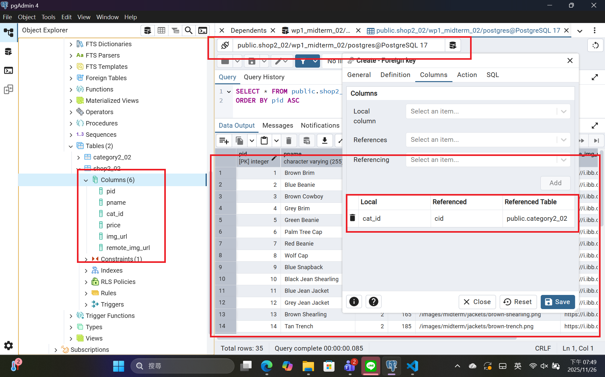
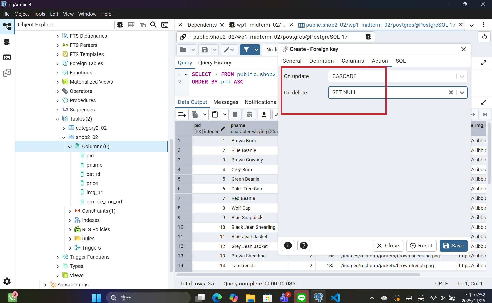
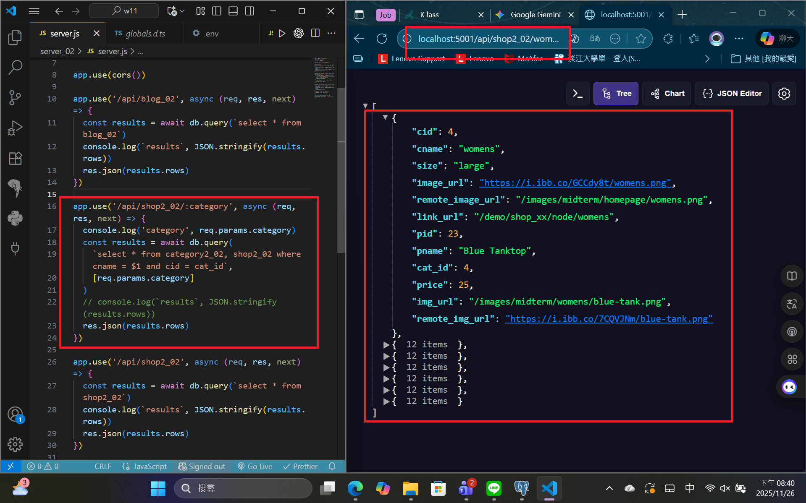
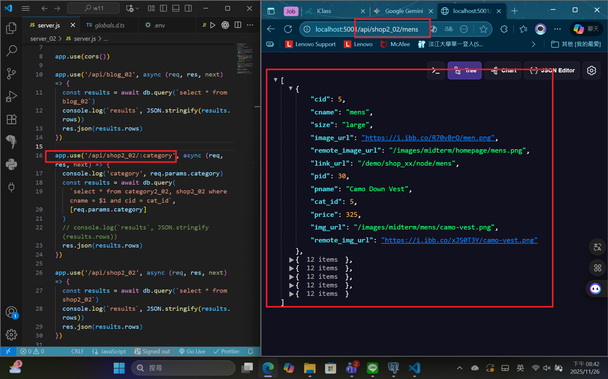
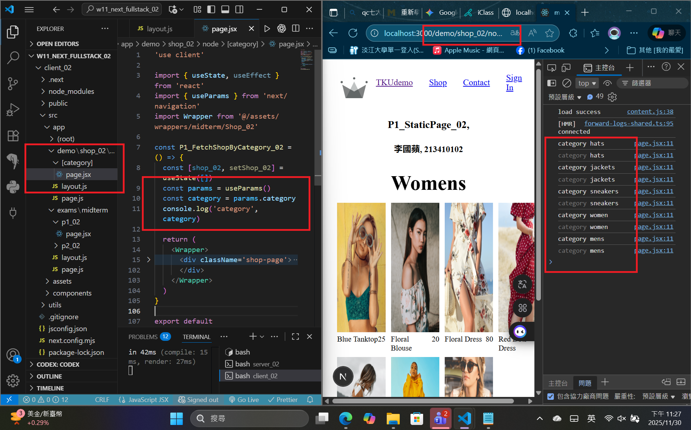
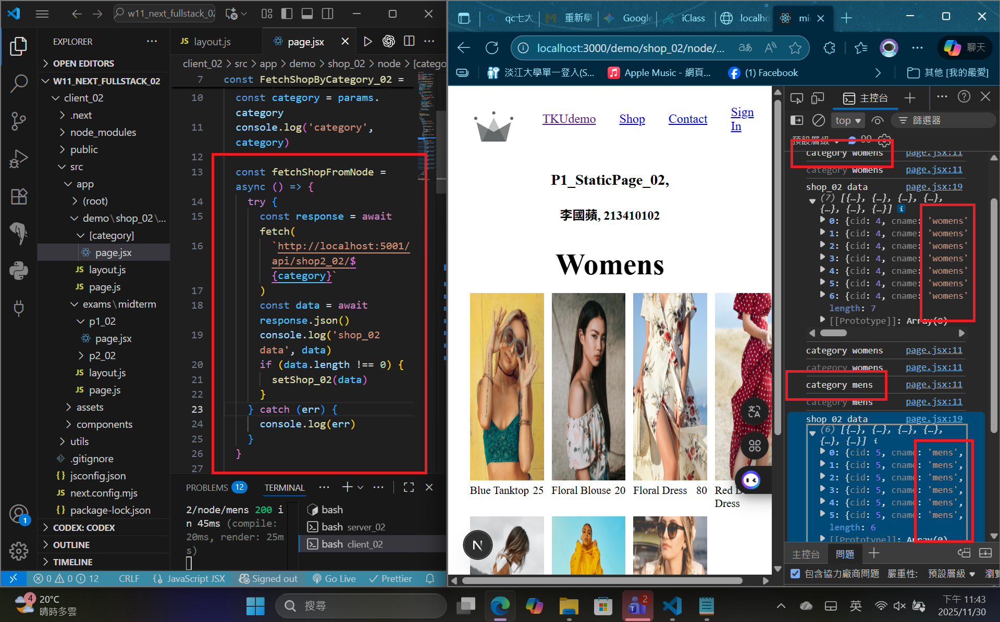
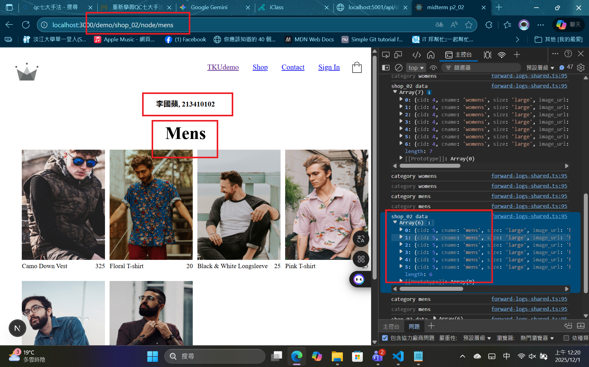
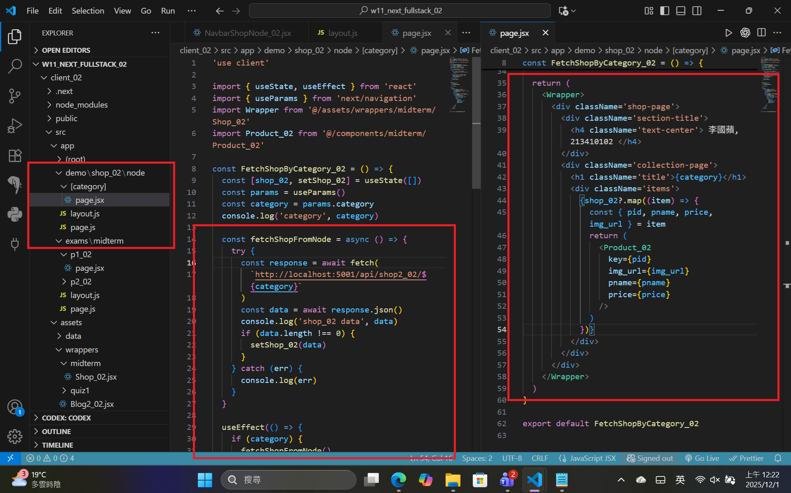

[Github URL](https://github.com/apple550678/1141-2N-demo-apple-02)
[Github URL for Vercel](https://github.com/apple550678/1141_2N_demo_vercel_apple-02)
[Vercel URL](https://1141-2-n-demo-vercel-apple-02.vercel.app/localjson_02)

### Video: W11-P1: Implement route /api/shop_xx/:category in server

##### => create tables category2_xx and shop2_xx using SQL and set foreign key of cat_id referencing to cid in category2_xx



##### => update and delete constraints of the foreign key



##### => Chrome, show /api/shop_xx/womens with code (you need to use last two digits of your id)



##### => Chrome, show /api/shop_xx/mens with code (you need to use last two digits of your id)



```
039b62f apple550678     2025-12-01 00:26:57 +0800       Video: W11-P1: Implement route /api/shop_xx/:category in server
```

###　 Video: W11-P2: Implement /demo/shop_xx/node and /demo/shop/node/:category in client

#### => show how to get category from params



#### => show how to fetch category from the category main page



#### => Chrome, show FetchShopByCategory_xx.jsx by click Mens



#### => relevant code for FetchShopByCategory_xx



```
a2127c5 htchung Wed Nov 26 20:48:10 2025 +0800  W11-P2: Implement /demo/shop_xx/node and /demo/shop/node/:category in client
```
