[Github URL](https://github.com/apple550678/1141-2N-demo-apple-02)
[Github URL for Vercel](https://github.com/apple550678/1141_2N_demo_vercel_apple-02)
[Vercel URL](https://1141-2-n-demo-vercel-apple-02.vercel.app/localjson_02)

###　 Video: W12-P1: Refine code of /demo/shop_xx/node

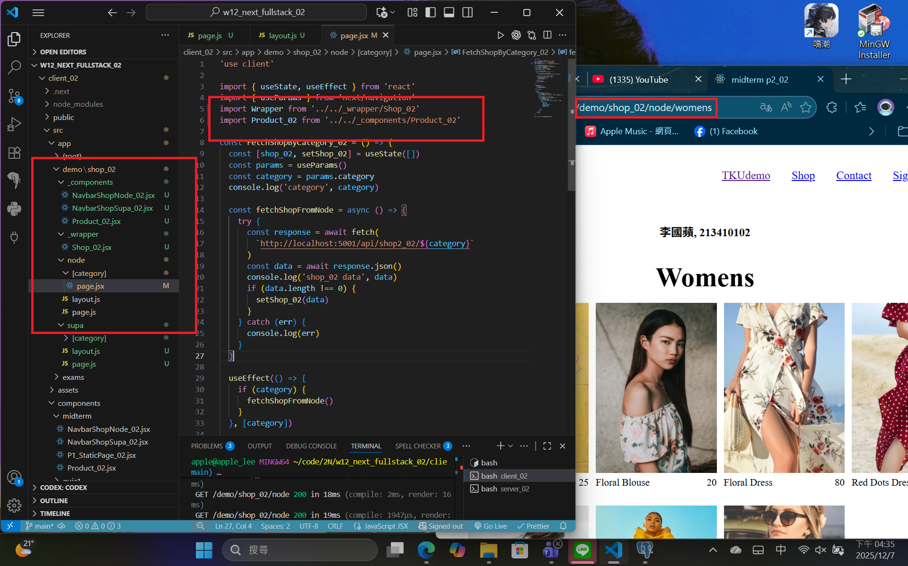

```
42a2d41 apple550678     2025-12-07 17:31:22 +0800       Video: W12-P1: Refine code of /demo/shop_xx/node
```

### W12-P2: Deploy code to Vercel

#### => npm run build

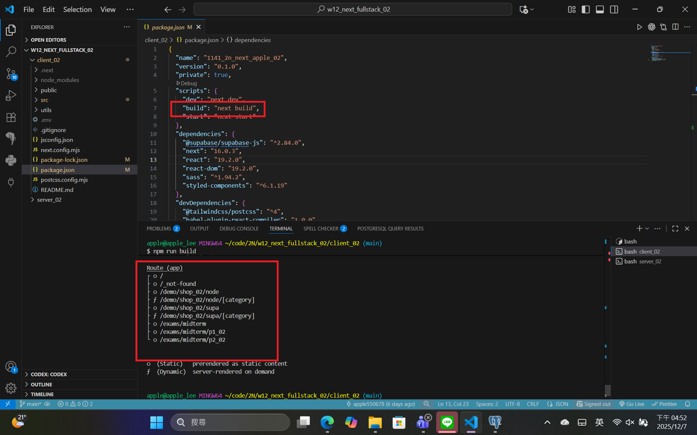

#### => npm start

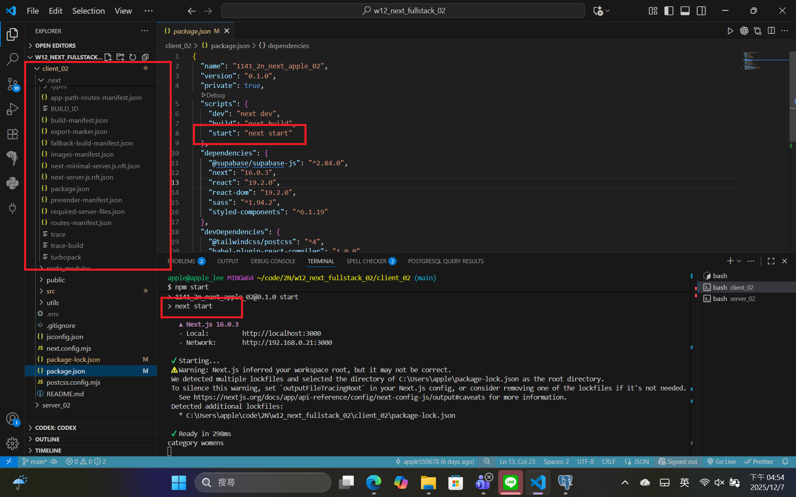

#### => Vercel, add environment variables

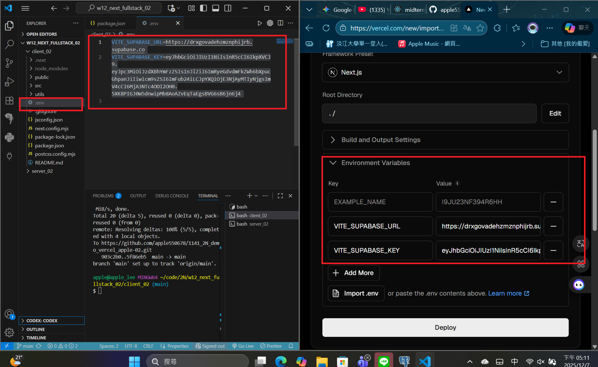

#### => Vercel homepage success

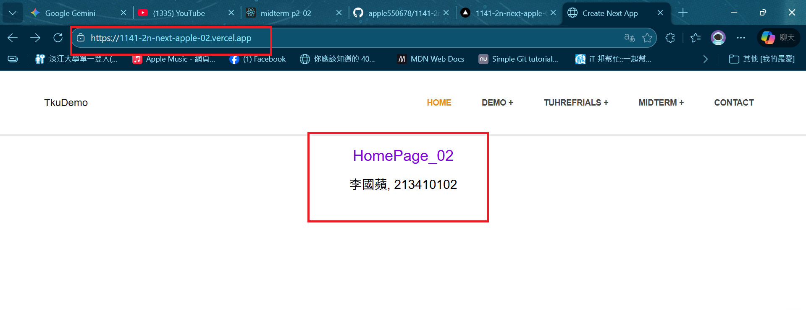

#### => Github repo and Vercel URL

[Gitbub Next URL](https://github.com/apple550678/1141-2n-next-apple-02)
[Vercel Next URL](https://1141-2n-next-apple-02.vercel.app/)

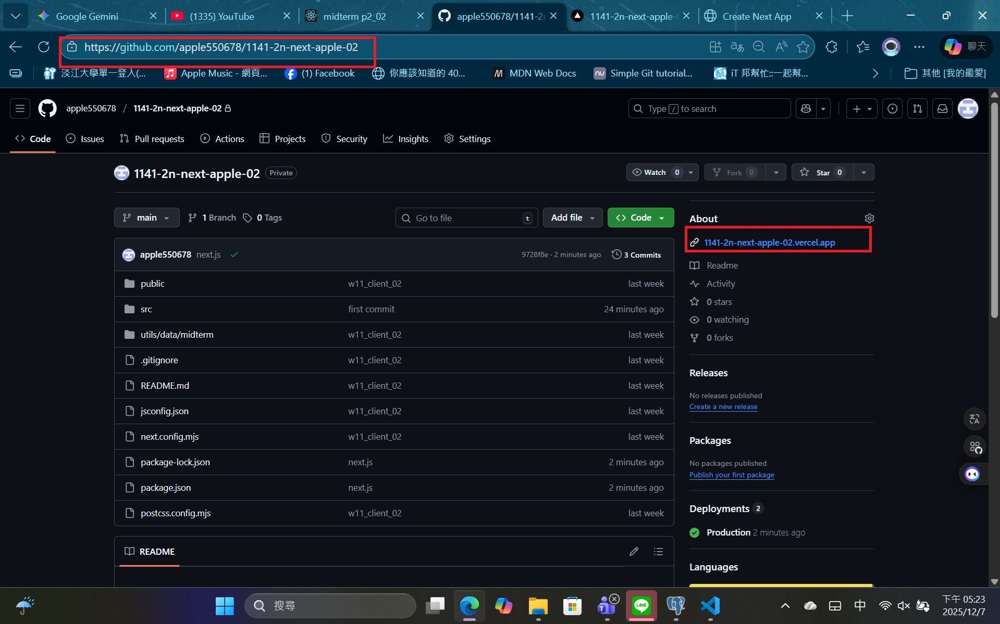

#### => Share to teacher and TA

htchung@gms.tku.edu.tw
sian-0018


```
bac54c9 apple550678     2025-12-07 17:33:55 +0800       W12-P2: Deploy code to Vercel
```

###　 Video: W12-P3: Implenment /demo/shop2_xx/supabase to fetch products from Supabase

#### => use SQL to get category2_xx data

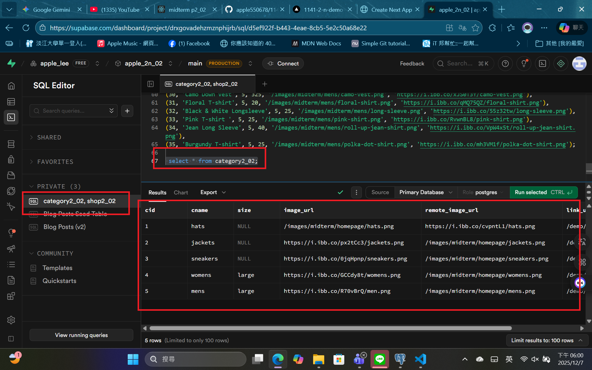

#### => use SQL to get shop2_xx data

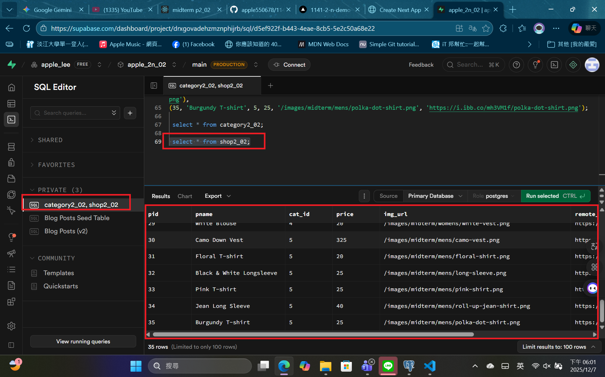

#### => set foreign key

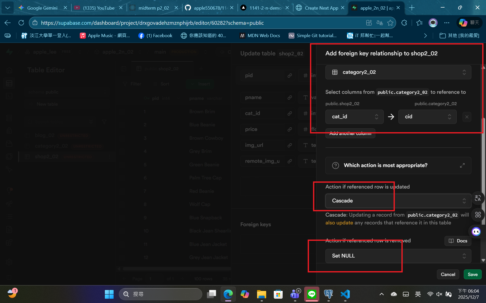

#### => set RLS policies for public access for all CRUD

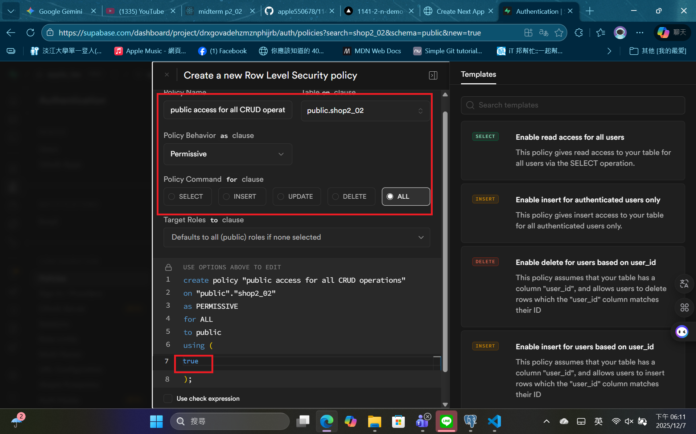

#### => Chrome \_ local

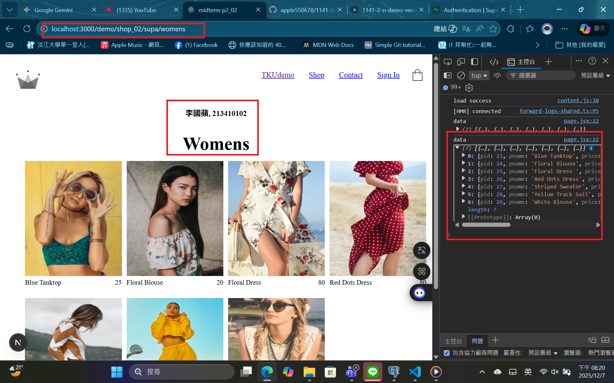

#### => Chrome \_ Vercel

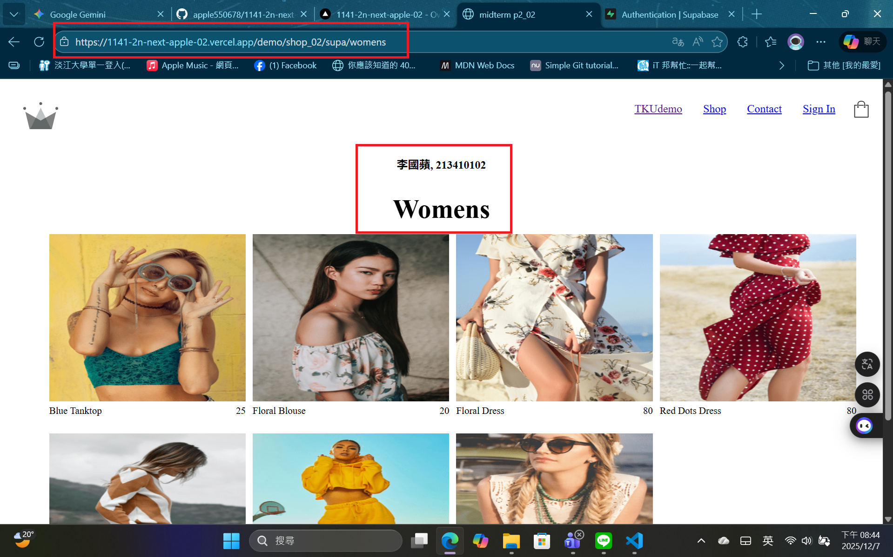

```

```
