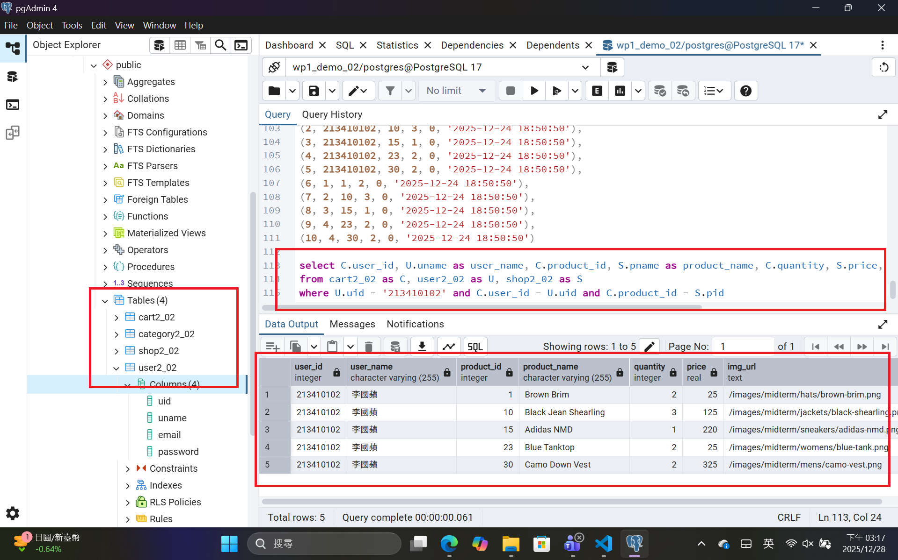
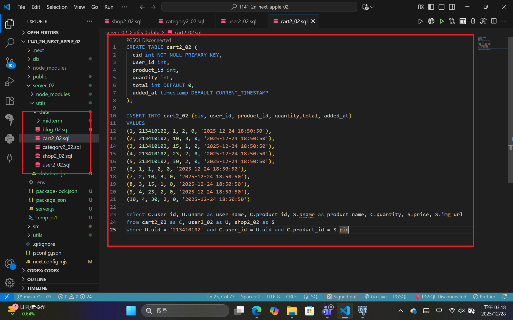
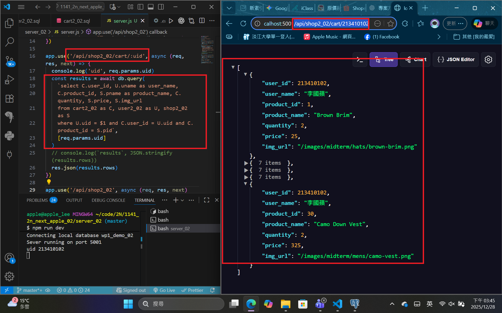

[Github URL](https://github.com/apple550678/1141-2N-demo-apple-02)
[Github URL for Vercel](https://github.com/apple550678/1141_2N_demo_vercel_apple-02)
[Vercel URL](https://1141-2-n-demo-vercel-apple-02.vercel.app/localjson_02)

### Video: W15-P1: Create tables category2_xx, shop2_xx, user2_xx, cart2_xx, and put 5 products into a cart for the user of your id

#### => pgAdmin4, show SQL command to get the needed info



#### => sql code



```
f43d4bd apple550678     2025-12-28 15:20:35 +0800       Video: W15-P1: Create tables category2_xx, shop2_xx, user2_xx, cart2_xx, and put 5 products into a cart for the user of your id
```

###　 Video: W15-P2: Implement route /api/shop_xx/cart/:uid to get the info as the SQL in W15-P1



```

```
